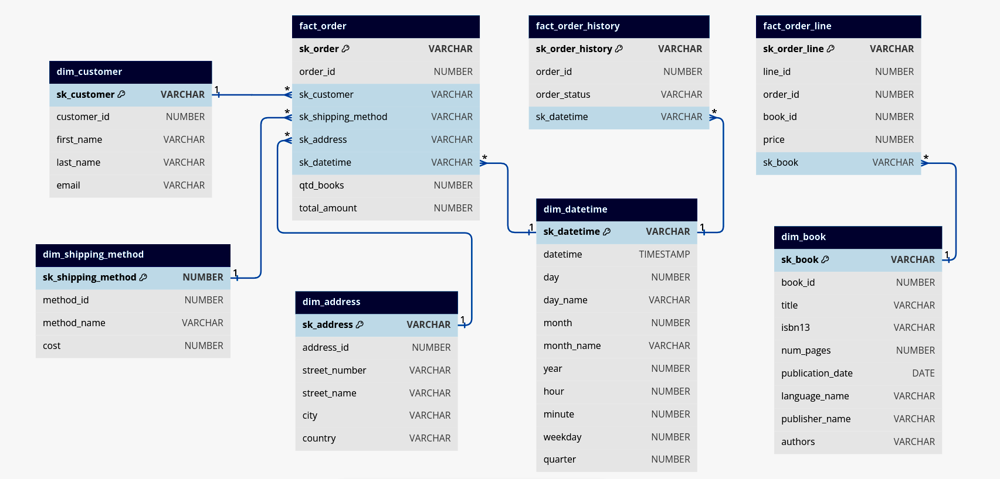
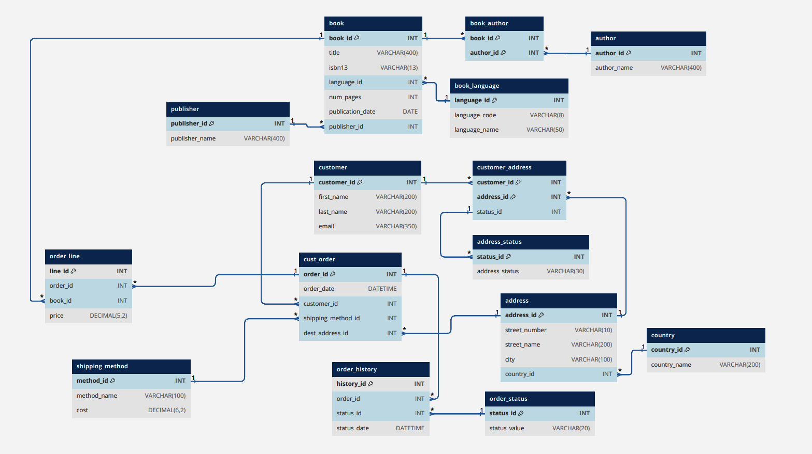
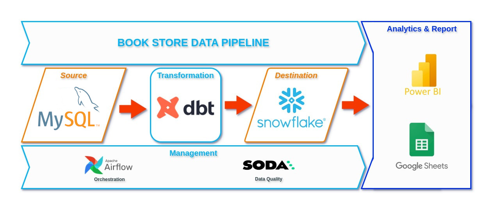
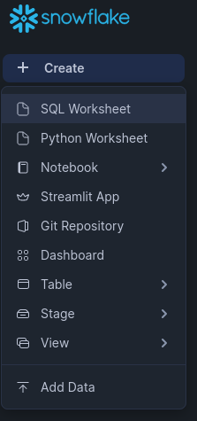
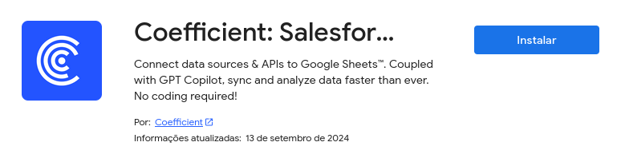

# Bookstore Project

## Table of Contents

- [About](#about)
- [Project Story](#story)
- [How to Run](#run)
- [Final Considerations](#end)

## About <a name = "about"></a>

This project aims to provide a data engineering-based solution to support decision-making for a fictional bookstore. The solution involves capturing data from a database and transforming it into a dimensional model for reporting and analysis. **DBT** was responsible for data transformation, while **Snowflake** was used for storage. **Apache Airflow** orchestrated the workflow, and **Soda** ensured data quality. The tools **Power BI** and **Google Sheets** were used for data visualization and analysis.

## Project Story <a name = "story"></a>

**BookWise** is a mid-sized bookstore offering a wide variety of books, both in physical stores and online. Founded over 10 years ago, BookWise has become a reference point for literature lovers, with a catalog ranging from global literary classics to contemporary releases.

In recent years, the bookstore has experienced significant growth in online sales, creating the need to organize and structure its data to optimize operations and improve the customer experience.

You were tasked with developing a data engineering solution to support strategic decisions. The goal is to turn scattered raw data into clear insights by organizing and structuring the data pipeline from ingestion to visualization.

The bookstore has a database full of information on sales, customers, products, and inventory, but this data is disorganized, making accurate analyses and data-driven decisions difficult. Your first task was to create a data structure that allows easy access to essential information, improving reporting and visualization efficiency.

After meetings with stakeholders, it was decided that the data would be stored in a **Data Warehouse** following this structure:
<h4 align="center">OLAP</h4>
<div align="center"></div>
<h4 align="center">BookWise OLTP Structure </h4>
<div align="center"></div>

The tools used were chosen according to project requirements, considering scalability, costs, and integration with existing infrastructure, ensuring an efficient and sustainable solution.

<h4 align="center">Data Pipeline</h4>
<div align="center"></div>

### Capture and Storage in Snowflake

The first step is to migrate the data to **Snowflake**, a cloud-based data warehouse platform that offers scalability and performance.

### Transformation with DBT

With the data in Snowflake, it needs to be transformed into a format that facilitates analysis. Using **DBT** (Data Build Tool), the data will be organized into a dimensional model. This model separates the data into fact and dimension tables, making it easier to create reports and analyses.

### Orchestration with Apache Airflow

To ensure the entire data pipeline runs efficiently and automatically, **Apache Airflow** will be used to orchestrate the workflow. In Airflow, **DAGs** (Directed Acyclic Graphs) can be created to automate data ingestion, transformation, and loading. This will allow tasks to run on a scheduled basis without manual intervention, ensuring data is continuously updated.

### Data Quality Assurance with Soda

Data quality is essential for decisions to be based on reliable information. **Soda** will be integrated into the pipeline, a tool that monitors data integrity throughout the process. **Soda** will run automated checks, ensuring no incorrect, duplicate, or missing data. Any issues detected will be quickly identified, allowing corrective actions before the data is used in reports.

### Visualization and Analysis with Power BI and Google Sheets

Finally, the transformed and validated data will be made available for analysis by the entire team. **Power BI** will be used to create interactive dashboards that allow the bookstore teams to view the KPIs. **Google Sheets** will be used for simple collaborative reports, such as a broadcast list.

## How to Run <a name = "run"></a>

### Prerequisites
- [Snowflake Account](https://signup.snowflake.com/)
- [Soda Account](https://cloud.soda.io/select-region)
- [Astro CLI](https://www.astronomer.io/docs/astro/cli/install-cli)
- [Power BI](https://www.microsoft.com/en-us/download/details.aspx?id=58494)
- [Google Sheets](https://docs.google.com/spreadsheets/u/0/create)
- [Git](https://git-scm.com/downloads)

### Step-by-Step Guide

#### Step 1: Clone the Repository

Start by cloning the project repository:

```
git clone https://github.com/mr-lops/book_store_project.git
cd book_store_project
```

#### Step 2: Create a Trial Account on Snowflake

1. Go to [Snowflake](https://signup.snowflake.com/) and create a trial account.

2. Once your account is set up, open a SQL Worksheet
.<div></div>

3. Run the code in the **snowflake.sql** file to create the necessary resources for the project.

#### Step 3: Create a Trial Account on Soda

1. Go to [Soda](https://cloud.soda.io/select-region) and create a trial account.
2. After creating your account, generate [API keys](https://docs.soda.io/soda-cloud/api-keys.html)) and save them for later use.

#### Step 4: Install Airflow via Astro CLI

1. With Astro CLI installed, run the following command in the project directory to initialize the Airflow environment:
```
astro dev init
```

2. Open the **.env** file and add the environment variables from **.env template**, modifying only the following variables:
```
SNOWFLAKE_USER='Your Snowflake User'
SNOWFLAKE_PASSWORD='Your Snowflake Password'
SNOWFLAKE_ACCOUNT='Your Snowflake Account' # Example example.us-east-1

SODA_API_KEY_ID='Your Soda ApiKeyID'
SODA_API_KEY_SECRET='Your Soda ApiKeySecret'
SODA_API_HOST='Your Soda ApiHost' # cloud.soda.io or cloud.us.soda.io
```

#### Step 5: Execute the Data Pipeline

1. Start the local Airflow server:
```
astro dev start
```

2. Access the Airflow UI in your browser (typically at http://localhost:8080).

3. Find the project DAG and click "Trigger" to execute it, starting the data pipeline.

#### Step 6: Create a Spreadsheet in Google Sheets and Connect with Coefficient

1. In Google Sheets, create a new spreadsheet.

2. Install the Coefficient add-on
.<div></div>

3. Follow the instructions to connect your spreadsheet to Snowflake.

4. Configure reports and dashboards in Google Sheets for collaborative analysis (the **broadcast_list.xml** file is an example using the **broadcast_list** table in Snowflake).

#### Step 7: Connect to Power BI

1. Open Power BI and select "Get Data" > "Snowflake."

2. Enter your Snowflake credentials and connect to the database.

3. Create interactive dashboards to view the bookstore's key KPIs (files **dash_book_sales.pbix** and **dash_revenue_period.pbix** are examples).

# BookWise Data Pipeline

## Final Considerations <a name="end"></a>

This project demonstrates a comprehensive data engineering solution, covering the entire lifecycle from ingestion and transformation to visualization and analysis, using modern and scalable tools.

Throughout the development of this project, valuable knowledge was acquired in various areas of data engineering, such as:

- **Dimensional Modeling**: The practice of transforming raw data into a dimensional model, with fact and dimension tables, proved essential for creating efficient reports and more detailed analyses.
  
- **Pipeline Orchestration**: By using **Apache Airflow**, it was possible to learn how to automate complex workflows, scheduling data ingestion and transformation efficiently, without the need for manual intervention.
  
- **Data Quality Monitoring**: Integrating with **Soda** highlighted the importance of continuously monitoring data quality, ensuring that decisions are based on accurate and consistent information.
  
- **Visualization Tools**: Working with **Power BI** and **Google Sheets** helped to understand the importance of clear and objective data visualization, allowing end users to extract insights intuitively.

## Challenges Faced

- **Tool Integration**: One of the biggest challenges was integrating different tools such as **Snowflake**, **DBT**, **Airflow**, and **Soda**, ensuring that they all communicated properly within the data pipeline.

- **Data Quality**: Ensuring data quality from end to end, from ingestion to analysis, required establishing validation rules.

- **Orchestration and Scalability**: Creating a scalable and efficient data flow in **Airflow** was challenging, especially when configuring complex DAGs with task dependencies. Adjustments were necessary to avoid failures.

## Possible Improvements

- **Data Migration with Airbyte**: Currently, the project relies on manual scripts for data migration. Adopting [Airbyte](https://airbyte.com/) could automate and simplify this process.

- **Enhanced Data Quality Testing**: Although **Soda** is integrated into the pipeline to ensure data quality, additional tests could be added to cover more scenarios, such as detailed referential integrity checks and compliance with business rules.

- **User Profiles for Data Consumption**: To improve data security and governance, it may be beneficial to create user profiles for consumption only, limiting access to read operations in Snowflake and visualization platforms like **Power BI** and **Google Sheets**. This would help ensure that only authorized users have access to the data, minimizing risks.

- **Query Optimization with Partitioning**: As data volume grows, queries may become slower. Implementing a partitioning strategy in Snowflake or other storage tools could optimize query performance, especially for large-scale fact tables. This would enable faster queries and more efficient data analysis.

With these improvements, the **BookWise** bookstore's data pipeline will become even more robust, scalable, and prepared for future growth, while also ensuring greater data reliability and governance.