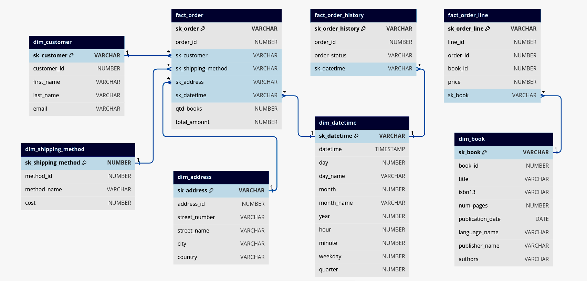
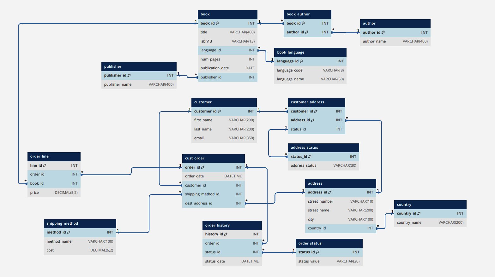
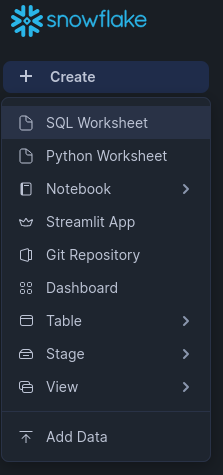
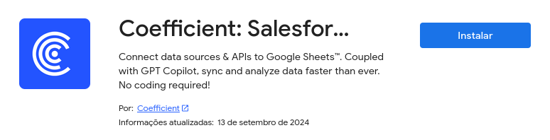

# Projeto Livraria

## Índice

- [Sobre](#about)
- [Narrativa do Projeto](#story)
- [Como Rodar o Projeto](#run)
- [Considerações Finais](#end)

## Sobre <a name = "about"></a>

Este projeto tem como objetivo oferecer uma solução baseada em técnicas de
engenharia de dados para apoiar a tomada de decisões de uma livraria fictícia. A
solução envolve a captura de dados de um banco de dados, transformando-os em
um modelo dimensional para relatórios e análises. O DBT foi responsável pela
transformação dos dados, enquanto o Snowflake foi utilizado para armazenamento.
A orquestração do fluxo de trabalho foi realizada com Apache Airflow, e a qualidade
dos dados foi garantida com Soda. Para a visualização e análise dos dados, foram
utilizadas as ferramentas Power BI e Google Sheets.

## Narrativa do Projeto <a name = "story"></a>

A BookWise é uma livraria de médio porte que oferece uma ampla variedade de livros, tanto em suas lojas físicas quanto em sua plataforma online. Fundada há mais de 10 anos, a BookWise se tornou um ponto de referência para amantes de literatura, com um catálogo que vai desde clássicos da literatura mundial até lançamentos contemporâneos.

Nos últimos anos, a livraria experimentou um crescimento significativo em suas vendas online, o que gerou uma necessidade de organizar e estruturar seus dados para otimizar as operações e melhorar a experiência do cliente.

Você foi encarregado de desenvolver uma solução de engenharia de dados, com o objetivo de apoiar decisões estratégicas. A missão é transformar dados brutos dispersos em insights claros, organizando e estruturando o pipeline de dados desde a ingestão até a visualização.

A livraria possui um banco de dados repleto de informações de vendas, clientes, produtos e estoques, mas esses dados estão desorganizados, dificultando análises precisas e decisões baseadas em dados. Sua primeira tarefa foi criar uma estrutura de dados que permita fácil compreenção a informações essenciais, melhorando a eficiência de relatórios e visualizações.

Após reuniões com os stakeholders, foi decidido que os dados seriam armazenados em um Data Warehouse seguindo a seguinte extrutura:
<h4 align="center">OLAP</h4>
<div align="center"></div>
<h4 align="center">Estrutura OLTP do banco de dados da BookWise</h4>
<div align="center"></div>

<br>
As ferramentas que serão utilizadas tambem foram definidas de acordo com os requisitos do projeto, levando em conta escalabilidade, custos e integração com a infraestrutura existente, garantindo que seja solução eficiente e sustentável.

<h4 align="center">Fluxo dos Dados</h4>
<div align="center"></div>
<br>

### Captura e Armazenamento no Snowflake
O primeiro passo será migrar os dados para o Snowflake, uma plataforma de data warehouse em nuvem que oferece escalabilidade e performance.

### Transformação com DBT

Com os dados no Snowflake, será necessário transformá-los em um formato que facilite a análise. Utilizando o DBT (Data Build Tool), as informações serão organizadas em um modelo dimensional. Esse modelo separa os dados em tabelas de fatos e dimensões, o que facilita a criação de relatórios e análises.

### Orquestração com Apache Airflow

Para garantir que todo o pipeline de dados funcione de forma eficiente e automatizada, será utilizado o Apache Airflow para orquestrar o fluxo de trabalho. No Airflow, é possivel criar DAGs (Directed Acyclic Graphs) que vão automatizar a ingestão, transformação e carga dos dados. Isso permitirá que as tarefas rodem de forma programada e sem necessidade de intervenção manual, garantindo que os dados sejam atualizados continuamente.

### Garantia de Qualidade com Soda

A qualidade dos dados é essencial para que as decisões sejam baseadas em informações confiáveis. Por isso, o Soda será integrado ao pipeline, Soda é uma ferramenta que monitorará a integridade dos dados durante todo o processo. O Soda irá executar checks automáticos, garantindo que não haja dados incorretos, duplicados ou faltantes. Qualquer problema detectado será identificado rapidamente, permitindo ações corretivas antes que os dados sejam utilizados em relatórios.

### Visualização e Análise com Power BI e Google Sheets

Por fim, os dados transformados e validados serão disponibilizados para a análise de toda a equipe. O Power BI, será utilizado para criar dashboards interativos que vão permitir às equipes da livraria visualizar os principais KPIs. O Google Sheets será utilizado para relatórios colaborativos mais simples, como uma lista de transmissão.

## Como Rodar o Projeto <a name = "run"></a>

### Pré-requisitos
- [Conta Snowflake](https://signup.snowflake.com/)
- [Conta Soda](https://cloud.soda.io/select-region)
- [Astro CLI](https://www.astronomer.io/docs/astro/cli/install-cli)
- [Power BI](https://www.microsoft.com/pt-br/download/details.aspx?id=58494)
- [Google Sheets](https://docs.google.com/spreadsheets/u/0/create)
- [Git](https://git-scm.com/downloads)

### Passo a Passo

#### Passo 1: Clonar o Repositório

Comece clonando o repositório com o código do projeto:

```
git clone https://github.com/mr-lops/book_store_project.git
cd book_store_project
```

#### Passo 2: Criar Conta Trial no Snowflake

1. Acesse [Snowflake](https://signup.snowflake.com/) e crie uma conta trial.

2. Após criar sua conta, abra um SQL Worksheet
.<div></div>

3. Execute o código que esta no arquivo **snowflake.sql** para criar os recursos necessários para o projeto.

#### Passo 3: Criar Conta Trial no Soda

1. Acesse [Soda](https://cloud.soda.io/select-region) e crie uma conta trial.

2. Após criar sua conta, gere [chaves de API](https://docs.soda.io/soda-cloud/api-keys.html) e as guarde pois serão utilizadas posteriormente.

#### Passo 4: Instalação do Airflow via Astro CLI

1. Com o Atro CLI instalado, execute o seguinte comando no diretório do projeto para inicializar o ambiente Airflow:
```
astro dev init
```

2. Abra o arquivo **.env** e adicione as variáveis de ambiente existentes do arquivo **.env template**, alterando somente as seguintes variaveis:
```
SNOWFLAKE_USER='Your Snowflake User'
SNOWFLAKE_PASSWORD='Your Snowflake Password'
SNOWFLAKE_ACCOUNT='Your Snowflake Account' # Example example.us-east-1

SODA_API_KEY_ID='Your Soda ApiKeyID'
SODA_API_KEY_SECRET='Your Soda ApiKeySecret'
SODA_API_HOST='Your Soda ApiHost' # cloud.soda.io or cloud.us.soda.io
```

#### Passo 5: Execução do Fluxo de Dados

1. Inicie o servidor local do Airflow:
```
astro dev start
```

2. Acesse o Airflow UI no navegador (normalmente em http://localhost:8080).

3. Encontre a DAG do projeto e clique em "Trigger" para executá-la. Isso iniciará o pipeline de dados.

#### Passo 6: Criar Planilha no Google Sheets e Conectar com o Coefficient

1. No Google Sheets, crie uma nova planilha.

2. Instale o add-on Coefficient
.<div></div>

3. Siga as instruções para conectar sua planilha ao Snowflake.

4. Configure os relatórios e dashboards no Google Sheets para análise colaborativa.(O arquivo **broadcast_list.xml** é um exemplo que foi construido utilizando a tabela **broadcast_list** no Snowflake).

#### Passo 7: Conectar ao Power BI

1. Abra o Power BI e selecione "Obter Dados" > "Snowflake".

2. Insira as credenciais do Snowflake e conecte-se ao banco de dados.

3. Crie dashboards interativos para visualizar os principais KPIs da livraria. (Os arquivos **dash_book_sales.pbix** e **dash_revenue_period.pbix** são exemplos de dashboards)

## Considerações Finais <a name="end"></a>

Este projeto demonstra uma solução completa de engenharia de dados, desde a ingestão e transformação até a visualização e análise, utilizando ferramentas modernas e escaláveis.

Durante o desenvolvimento deste projeto, foram adquiridos conhecimentos valiosos em diversas áreas da engenharia de dados, tais como:

- **Modelagem Dimensional**: A prática de transformar dados brutos em um modelo dimensional, com tabelas de fatos e dimensões, provou ser essencial para a criação de relatórios eficientes e análises mais detalhadas.
  
- **Orquestração de Pipeline**: Com o uso do **Apache Airflow**, foi possível aprender a automatizar fluxos de trabalho complexos, programando a ingestão e transformação de dados de forma eficiente, sem a necessidade de intervenção manual.
  
- **Monitoramento da Qualidade dos Dados**: A integração com **Soda** trouxe a importância de monitorar continuamente a qualidade dos dados, garantindo que as decisões sejam tomadas com base em informações precisas e consistentes.
  
- **Ferramentas de Visualização**: Trabalhar com **Power BI** e **Google Sheets** ajudou a entender a importância de uma visualização clara e objetiva dos dados, permitindo que os usuários finais consigam extrair insights de maneira intuitiva.

### Desafios Enfrentados

Ao longo do projeto, vários desafios surgiram, proporcionando aprendizados importantes:

- **Integração de Ferramentas**: Um dos maiores desafios foi integrar ferramentas distintas, como **Snowflake**, **DBT**, **Airflow** e **Soda**, garantindo que todas se comunicassem adequadamente dentro do pipeline de dados.

- **Qualidade dos Dados**: Garantir a qualidade dos dados de ponta a ponta, desde a ingestão até a análise, exigiu o estabelecimento de regras de validação.

- **Orquestração e Escalabilidade**: Criar um fluxo de dados escalável e eficiente no **Airflow** foi desafiador, principalmente ao configurar DAGs complexos com dependências entre tarefas. Ajustes foram necessários para evitar falhas.

### Possíveis Melhorias

Apesar da solução atual atender aos requisitos do projeto, algumas melhorias podem ser consideradas para otimizar o pipeline de dados e garantir uma maior eficiência e escalabilidade no futuro:

- **Migração de Dados com Airbyte**: Atualmente, o projeto depende de scripts manuais para a migração de dados. A adoção do [Airbyte](https://airbyte.com/) poderia automatizar e simplificar esse processo.

- **Aprimoramento dos Testes de Qualidade dos Dados**: Embora o **Soda** esteja integrado ao pipeline para garantir a qualidade dos dados, mais testes podem ser adicionados para cobrir cenários adicionais, como verificações mais detalhadas de integridade referencial e conformidade com regras de negócio.

- **Criação de Perfis de Usuário para Consumo de Dados**: Para melhorar a segurança e a governança de dados, pode ser interessante criar perfis de usuário somente para consumo, limitando o acesso a operações de leitura no Snowflake e nas plataformas de visualização, como **Power BI** e **Google Sheets**. Isso ajudaria a garantir que apenas usuários autorizados tenham acesso aos dados, minimizando riscos.

- **Otimização de Consultas com Particionamento**: À medida que o volume de dados cresce, as consultas podem se tornar mais lentas. Uma estratégia de particionamento no Snowflake ou em outras ferramentas de armazenamento poderia otimizar o desempenho das consultas, especialmente em tabelas factuais de grande escala. Isso permitiria consultas mais rápidas e uma análise de dados mais eficiente.

Com essas melhorias, o pipeline de dados da livraria **BookWise** se tornará ainda mais robusto, escalável e preparado para o crescimento futuro, além de garantir maior confiabilidade e governança de dados.